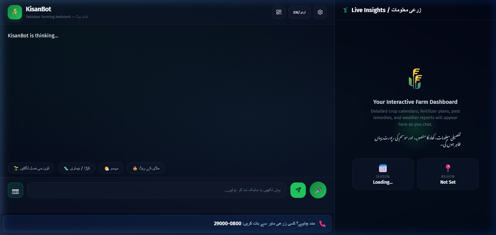
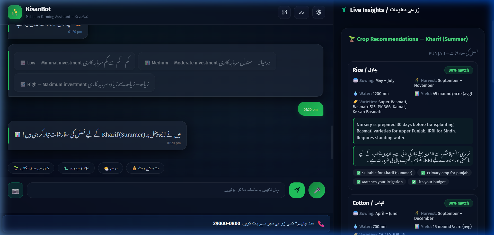
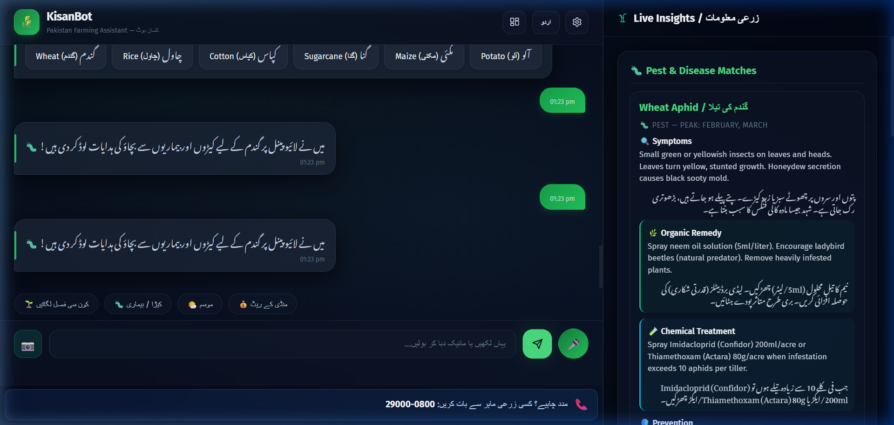
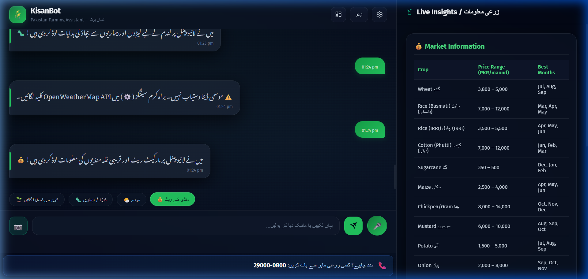
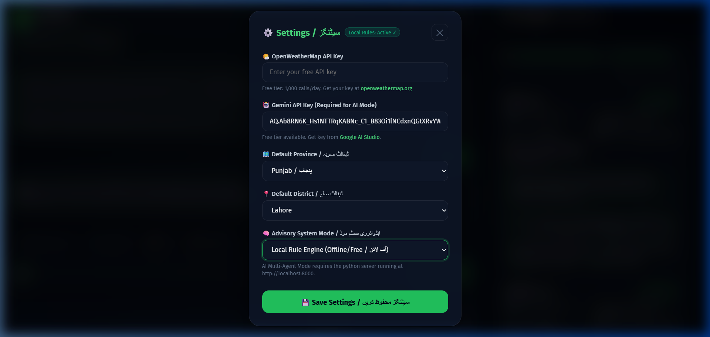

<

---

## 📌 The Problem It Solves

**Pakistan's 40+ million farmers — most of them smallholders with less than 5 acres — lack timely, localized agricultural advice.** Extension officers cover hundreds of villages each, government helplines have limited hours, and most farming apps are in English with complex UIs that don't work for low-literacy users.

KisanBot solves this by being:
- **Urdu-first** — the interface, responses, quick actions, and voice I/O all default to Urdu (اردو), the language farmers actually speak
- **Conversational** — farmers ask questions naturally ("میری گندم میں کیڑا لگ گیا ہے" / "My wheat has pests") instead of navigating menus
- **Voice-enabled** — supports Urdu speech recognition and text-to-speech for farmers who can't type
- **AI + Offline hybrid** — works with Gemini AI when online, falls back to a comprehensive local rule engine when offline (no data wasted)
- **Province-aware** — recommendations are tailored to Punjab, Sindh, KPK, and Balochistan with region-specific crop varieties, sowing windows, and mandi prices
- **Trustworthy** — never fabricates data; clearly labels sources; pesticide safety screening; always shows a helpline number for human expert access

### Who Is It For?
- 🧑‍🌾 **Small-scale Pakistani farmers** who need quick, actionable crop advice in Urdu
- 👨‍🏫 **Agriculture extension workers** who can use it as a field reference tool
- 🎓 **Agriculture students** learning about Pakistan-specific farming practices

---

## 🌐 Live Deployed URL

### **👉 [https://mubashir-ul-hassan.github.io/KisanBot/](https://mubashir-ul-hassan.github.io/KisanBot/)**

Open it on any device — desktop, tablet, or mobile. No installation needed.

---

## ✨ Features List

### Core Advisory Features
| Feature | Description |
|---------|-------------|
| 🌱 **Crop Recommendation** | Recommends best crops for the current season based on province, soil type, water availability, and budget — with a scored ranking system |
| 🐛 **Pest & Disease Diagnosis** | Identifies pests/diseases from text descriptions with organic + chemical remedies, symptoms, and prevention tips |
| 🧪 **Fertilizer Plans** | Provides stage-by-stage fertilizer schedules per crop (sowing, tillering, heading) with PKR cost estimates |
| 💰 **Market Prices** | Shows current mandi prices (PKR/maund) for major crops with best selling months and nearby mandis |
| 🌤️ **Weather Updates** | Live weather via OpenWeatherMap API with farming advisories |
| 📍 **Region-Aware** | Covers all 4 provinces with district-level granularity and local crop varieties |
| 📷 **Crop Photo Upload** | Take/upload photos of affected crops for visual diagnosis |

### User Experience Features
| Feature | Description |
|---------|-------------|
| 🎤 **Voice Input** | Speak in Urdu — Web Speech API with `ur-PK` recognition |
| 🔊 **Voice Output** | Bot reads responses aloud in Urdu TTS |
| 🌐 **Bilingual UI** | Full English/Urdu toggle — every label, button, and response is bilingual |
| 📊 **Live Insights Dashboard** | Right-side panel dynamically shows detailed data tables, crop cards, and pest remedies as you chat |
| ⚡ **Quick Action Buttons** | One-tap access to crop, pest, weather, and market features (Urdu labels) |
| 📞 **Helpline Bar** | Always-visible agriculture helpline (0800-29000) for human expert fallback |
| ⚙️ **Settings Panel** | Configure API keys, province, district, and system mode |

### Technical Features
| Feature | Description |
|---------|-------------|
| 🧠 **Dual-Mode Architecture** | AI Multi-Agent mode (Gemini API) + Local Rule Engine mode (fully offline) |
| 📦 **Comprehensive Knowledge Base** | 10 JSON data files with 200+ crop/pest/fertilizer/market entries |
| 🔄 **Smart Caching** | 10-minute cache for AI responses, 15-minute cache for weather |
| 🔒 **No Hardcoded Secrets** | API keys stored only in browser localStorage, never in code |
| 📱 **Responsive Design** | Works on mobile, tablet, and desktop with adaptive layouts |

---

## 🤖 AI Feature — Gemini Multi-Agent System

KisanBot uses **Google Gemini 2.0 Flash** as its AI backbone. When the user provides a Gemini API key, the app switches to an intelligent AI-powered mode with **7 specialized intent handlers**, each with its own crafted system prompt.

### How It Works

```
User Input (text/voice/photo)
       │
       ▼
  NLP Intent Parser (js/parser.js)
  — detects: crop, pest, weather, market, fertilizer, soil, season
       │
       ▼
  ┌─ AI Mode? ──────────────────────────┐
  │  YES → Gemini Agent (gemini-agent.js)│
  │  NO  → Rule Engine (engine.js)       │
  └──────────────────────────────────────┘
       │
       ▼
  Conversational Response + Live Dashboard Update
```

### The AI System Prompt (Core Instructions)

This is the **base system prompt** sent with every Gemini API call:

```
You are KisanBot, an expert Pakistani agricultural advisor.
Current date context: [Current Month] ([Current Season] season).
Province: [User's Province].

IMPORTANT: Respond ONLY as a valid JSON object with the fields specified.
Do NOT include any text outside the JSON. Do NOT use markdown code blocks.
Use Pakistani context (PKR currency, local varieties, local pest names,
maund unit = 40kg).
```

### Intent-Specific Prompts

Each intent has a detailed prompt that instructs Gemini to return structured JSON with bilingual (English + Urdu) content:

**1. Crop Recommendation Prompt** — Asks Gemini to recommend 3-4 crops with score, sowing window, expected yield, local varieties, cost per acre (PKR), and growing tips, all tailored to the user's province, soil, water, and budget.

**2. Pest & Disease Diagnosis Prompt** — From the farmer's text description, instructs Gemini to return 1-2 most likely diagnoses with symptoms, organic remedies, chemical treatments (Pakistan-available products like Confidor, Actara), and prevention.

**3. Fertilizer Plan Prompt** — Generates a stage-by-stage per-acre fertilizer plan with quantities in bags (50kg), application methods, and approximate PKR costs.

**4. Weather Advisory Prompt** — Provides seasonal farming advisory with typical conditions and what activities to do/avoid.

**5. Market Prices Prompt** — Returns approximate PKR/maund prices, government support prices, price trends, best selling months, and nearby mandi names.

**6. Soil Advisory Prompt** — Provides soil management advice, common soil types in the region, and improvement tips.

**7. Seasonal Guide Prompt** — Generates a complete seasonal farming calendar with crops to sow, current activities, and upcoming preparations.

> **All prompts enforce structured JSON output** so the dashboard can render rich UI cards, tables, and recommendation panels — not just plain text.

### AI Configuration
- **Model:** `gemini-2.0-flash` (free-tier friendly, fast responses)
- **Temperature:** `0.3` (low creativity, high accuracy — critical for farming advice)
- **Max Tokens:** `1200` (sufficient for detailed structured responses)
- **Caching:** 10-minute TTL to avoid duplicate API calls

---

## 🛠️ Tools, Services & AI Models Used

### AI & APIs
| Tool | Purpose |
|------|---------|
| **Google Gemini 2.0 Flash** | Core AI for all 7 advisory intents — crop, pest, fertilizer, market, weather, soil, season |
| **OpenWeatherMap API** | Live weather data (temperature, humidity, conditions) for any Pakistani city |
| **Web Speech API** | Browser-native Urdu speech recognition (`ur-PK`) and text-to-speech |

### Frontend
| Tool | Purpose |
|------|---------|
| **HTML5 + CSS3** | Semantic structure with dark-mode glassmorphism design |
| **Vanilla JavaScript** | Modular architecture — 8 JS modules (config, voice, parser, weather, engine, gemini-agent, conversation, app) |
| **CSS Custom Properties** | Full theming system with gradients, animations, and responsive breakpoints |

### Backend (Optional — for AI Multi-Agent Mode)
| Tool | Purpose |
|------|---------|
| **Python + FastAPI** | REST API server with 5 specialist agent modules |
| **ISRIC SoilGrids API** | Soil type data for any GPS coordinate (cached) |
| **Google Maps Geocoding** | Convert city/district names to coordinates |

### Data & Knowledge Base
| File | Contents |
|------|----------|
| `crop_calendar.json` | 15+ crops with sowing windows, harvest periods, varieties per province, water requirements |
| `crop_recommendations.json` | Scoring rules by season × province × water × budget |
| `pest_disease_data.json` | 20+ pests/diseases with symptoms, organic + chemical remedies |
| `fertilizer_data.json` | Stage-by-stage fertilizer plans for major crops |
| `market_info.json` | PKR prices, mandis, and selling strategies |
| `regions.json` | All 4 provinces with divisions, districts, agro-zones, soil types |
| `soil_data.json` | Soil types, characteristics, and improvement techniques |

### Deployment & DevOps
| Tool | Purpose |
|------|---------|
| **GitHub Pages** | Static site hosting (free, reliable) |
| **Git + GitHub** | Version control and public repository |

---

## 📸 Screenshots

### 1. Homepage — Chat Interface + Live Insights Dashboard

*The main interface showing the bilingual chat, Urdu quick-action buttons, voice input, camera upload, and the Live Insights dashboard panel.*

---

### 2. Crop Recommendation — Scored Results with Local Varieties

*Kharif (Summer) crop recommendations for Punjab showing Rice (80% match) and Cotton with sowing windows, water needs, yield estimates, and local varieties like Super Basmati and PK-386.*

---

### 3. Pest & Disease Diagnosis — Organic + Chemical Remedies

*Wheat pest diagnosis showing Wheat Aphid (گندم کی تیلا) with symptoms in English + Urdu, organic remedy (neem oil), and chemical treatment (Confidor/Actara) — all available in Pakistan.*

---

### 4. Market Prices — PKR Rates + Best Selling Months

*Live market information showing PKR/maund prices for Wheat, Basmati Rice, IRRI Rice, Cotton, Sugarcane, Maize, Chickpea, Mustard, Potato, and Onion with optimal selling months.*

---

### 5. Settings Panel — API Keys, Province, and System Mode

*Configuration panel where users enter their Gemini API key, select province/district, and choose between AI Multi-Agent or Local Rule Engine mode.*

---

## 🚀 How to Run the Project

### Option 1: Use the Live Deployed Version (Recommended)
Simply visit: **[https://mubashir-ul-hassan.github.io/KisanBot/](https://mubashir-ul-hassan.github.io/KisanBot/)**

1. Click ⚙️ Settings
2. Enter your **Gemini API Key** (free from [Google AI Studio](https://aistudio.google.com/apikey))
3. *(Optional)* Enter your **OpenWeatherMap API Key** (free from [openweathermap.org](https://openweathermap.org/api))
4. Select your **Province** and **District**
5. Click **Save Settings**
6. Start chatting! Use the quick buttons or type/speak your question.

### Option 2: Run Locally

```bash
# 1. Clone the repository
git clone https://github.com/Mubashir-Ul-Hassan/KisanBot.git
cd KisanBot

# 2. Open the frontend (no build step needed!)
# Simply open index.html in your browser
start index.html        # Windows
open index.html         # macOS
xdg-open index.html     # Linux

# 3. (Optional) Run the Python backend for AI Multi-Agent mode
pip install -r requirements.txt
cp .env.example .env    # Fill in your API keys
python server.py        # Starts on http://localhost:8000
```

### Option 3: Run with Python Backend (Full AI Mode)

```bash
# 1. Clone and enter the project
git clone https://github.com/Mubashir-Ul-Hassan/KisanBot.git
cd KisanBot

# 2. Create a virtual environment
python -m venv venv
source venv/bin/activate   # Linux/macOS
venv\Scripts\activate      # Windows

# 3. Install dependencies
pip install -r requirements.txt

# 4. Configure environment variables
cp .env.example .env
# Edit .env and add your GEMINI_API_KEY and GOOGLE_MAPS_API_KEY

# 5. (Optional) Pre-fetch soil data
python scripts/prefetch_soil.py

# 6. Start the backend server
python server.py
# Server runs at http://localhost:8000

# 7. Open index.html in your browser
# In Settings, switch to "AI Multi-Agent Brain" mode
```

### Environment Variables (`.env`)

| Variable | Required | Description |
|----------|----------|-------------|
| `GEMINI_API_KEY` | Yes (for AI mode) | Google Gemini API key from [AI Studio](https://aistudio.google.com/apikey) |
| `GOOGLE_MAPS_API_KEY` | Optional | For Weather + Geocoding APIs |
| `LLM_PROVIDER` | No | Default: `gemini` |
| `SOIL_ALLOW_LIVE` | No | Set to `1` only when running `prefetch_soil.py` |

> ⚠️ **Never commit API keys.** They are stored in `.env` (gitignored) or in browser localStorage only.

### Running Tests

```bash
python tests/scenarios.py
# Runs 10+ routing and safety check scenarios (no API key needed)
```

---

## 📁 Project Structure

```
KisanBot/
├── index.html              # Main app entry point
├── styles.css              # Primary stylesheet (dark glassmorphism theme)
├── styles-agent.css        # Agent-specific UI styles
├── js/
│   ├── config.js           # Configuration management (API keys, language, region)
│   ├── voice.js            # Speech recognition + TTS (Urdu + English)
│   ├── parser.js           # NLP intent detection (bilingual keyword matching)
│   ├── weather.js          # OpenWeatherMap integration
│   ├── engine.js           # Local rule-based recommendation engine
│   ├── gemini-agent.js     # Gemini AI agent with 7 intent-specific prompts
│   ├── conversation.js     # Chat flow management + dashboard rendering
│   └── app.js              # App initialization and event wiring
├── data/                   # Knowledge base (10 curated JSON files)
│   ├── crop_calendar.json
│   ├── crop_recommendations.json
│   ├── pest_disease_data.json
│   ├── fertilizer_data.json
│   ├── market_info.json
│   ├── regions.json
│   ├── soil_data.json
│   └── ...
├── agents/                 # Python multi-agent backend
│   ├── orchestrator.py     # Routes queries to specialist agents
│   ├── crop_recommendation.py
│   ├── crop_protection.py
│   ├── weather.py
│   ├── market.py
│   ├── image_diagnosis.py
│   └── prompts/            # Editable system prompt files
├── services/               # Backend service layer
│   ├── llm_client.py       # Thin Gemini API wrapper
│   ├── geocoding.py        # Google Geocoding integration
│   ├── weather_api.py      # Weather API service
│   ├── soil.py             # ISRIC SoilGrids integration
│   └── ...
├── server.py               # FastAPI backend server
├── tests/scenarios.py      # Automated routing + safety tests
├── requirements.txt        # Python dependencies
├── .env.example            # Environment variable template
├── .gitignore              # Keeps secrets and caches out of git
└── screenshots/            # App screenshots for README
```

---

## 🏗️ Architecture

```
┌─────────────────────────────────────────────────────────┐
│                    FRONTEND (Browser)                    │
│                                                         │
│  ┌─────────┐  ┌────────┐  ┌────────┐  ┌─────────────┐ │
│  │ Voice   │  │ Parser │  │ Engine │  │ Gemini Agent│ │
│  │ Module  │→ │ (NLP)  │→ │ (Rules)│  │ (AI Cloud)  │ │
│  └─────────┘  └────────┘  └───┬────┘  └──────┬──────┘ │
│                                │              │         │
│                    ┌───────────┴──────────────┘         │
│                    ▼                                     │
│          ┌──────────────────┐                            │
│          │  Conversation +  │                            │
│          │  Dashboard UI    │                            │
│          └──────────────────┘                            │
│                                                         │
├─────────────────────────────────────────────────────────┤
│               BACKEND (Optional — Python)               │
│                                                         │
│  ┌──────────────┐    ┌────────────────────────────────┐│
│  │ Orchestrator │───→│ Specialist Agents              ││
│  │ (Saathi)     │    │ • Crop Recommendation          ││
│  └──────────────┘    │ • Crop Protection (Pest/Disease)││
│                      │ • Weather                       ││
│                      │ • Market Prices                 ││
│                      │ • Image Diagnosis (Vision)      ││
│                      └────────────────────────────────┘│
└─────────────────────────────────────────────────────────┘
```

---

## 📜 License

This project was built as a final project submission for an AI application development course. It is original work solving a real problem for Pakistani farming communities.

---

**Built with ❤️ for Pakistan's farmers 🇵🇰**
]]>
