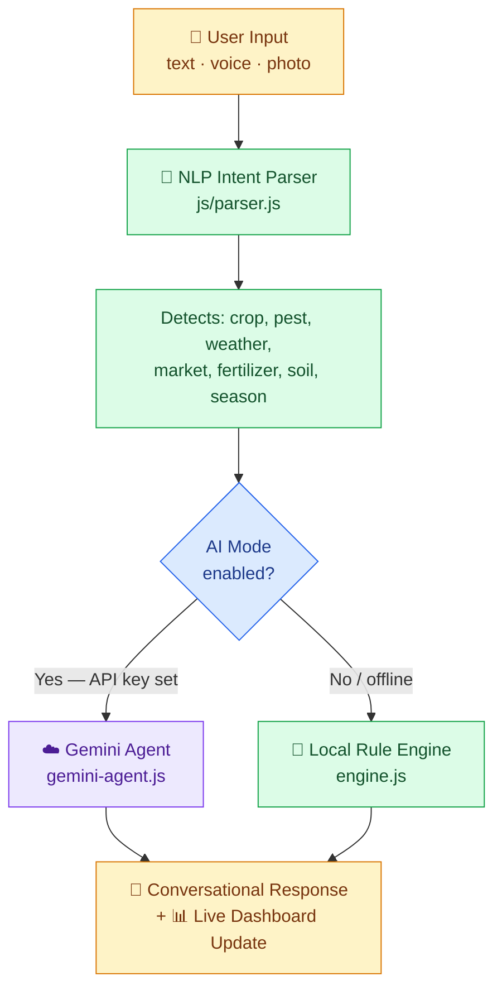
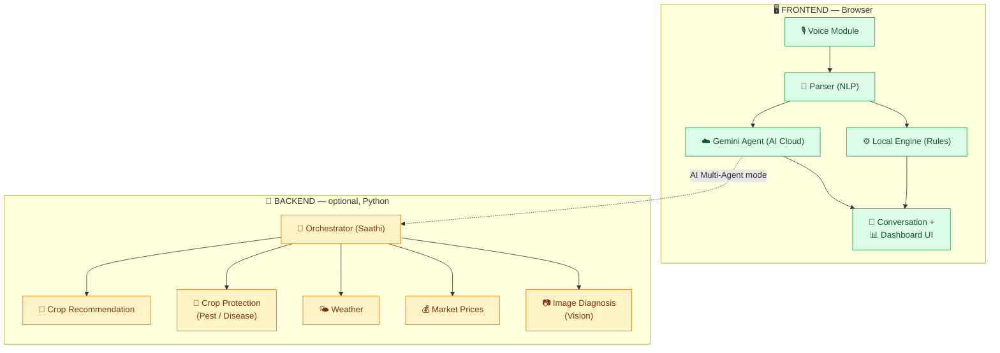

<div align="center">

# 🌾 KisanBot

### AI-Powered Bilingual Agricultural Advisory Chatbot for Pakistani Farmers

An AI-powered, bilingual (English + Urdu) agricultural advisory chatbot built for Pakistani farmers — providing crop recommendations, pest diagnosis, fertilizer plans, market prices, and weather updates through a conversational interface with voice support.

[](https://mubashir-ul-hassan.github.io/KisanBot/)
[](https://github.com/Mubashir-Ul-Hassan/KisanBot)
[](https://github.com/Mubashir-Ul-Hassan/KisanBot)
[](#license)

**[🔗 Live App](https://mubashir-ul-hassan.github.io/KisanBot/)** &nbsp;·&nbsp; **[🚀 Getting Started](#getting-started)** &nbsp;·&nbsp; **[🏗️ Architecture](#architecture)**


</div>

---

## 📋 Table of Contents

- [📌 The Problem It Solves](#problem)
- [✨ Features](#features)
- [⚙️ How It Works](#how-it-works)
- [🤖 AI System — Gemini Multi-Agent](#ai-system)
- [🏗️ Architecture](#architecture)
- [🛠️ Tech Stack](#tech-stack)
- [📦 Data & Knowledge Base](#data-kb)
- [📸 Screenshots](#screenshots)
- [🚀 Getting Started](#getting-started)
- [📁 Project Structure](#project-structure)
- [📜 License](#license)

---

<a id="problem"></a>
## 📌 The Problem It Solves

**Pakistan's 40+ million farmers — most of them smallholders with less than 5 acres — lack timely, localized agricultural advice.** Extension officers cover hundreds of villages each, government helplines have limited hours, and most farming apps are in English with complex UIs that don't work for low-literacy users.

KisanBot solves this by being:

- 🗣️ **Urdu-first** — the interface, responses, quick actions, and voice I/O all default to Urdu (اردو), the language farmers actually speak
- 💬 **Conversational** — farmers ask questions naturally instead of navigating menus, e.g. *"میری گندم میں کیڑا لگ گیا ہے"* ("My wheat has pests")
- 🎙️ **Voice-enabled** — supports Urdu speech recognition and text-to-speech for farmers who can't type
- 🔌 **AI + Offline hybrid** — works with Gemini AI when online, falls back to a comprehensive local rule engine when offline (no data wasted)
- 📍 **Province-aware** — recommendations tailored to Punjab, Sindh, KPK, and Balochistan with region-specific crop varieties, sowing windows, and mandi prices
- ✅ **Trustworthy** — never fabricates data, clearly labels sources, screens for pesticide safety, and always shows a helpline number for human expert access

**Who is it for?**

- 🧑‍🌾 **Small-scale Pakistani farmers** who need quick, actionable crop advice in Urdu
- 👨‍🏫 **Agriculture extension workers** who can use it as a field reference tool
- 🎓 **Agriculture students** learning about Pakistan-specific farming practices

---

<a id="features"></a>
## ✨ Features

### Core Advisory

| Feature | Description |
|---|---|
| 🌱 **Crop Recommendation** | Recommends the best crops for the current season based on province, soil type, water availability, and budget — with a scored ranking system |
| 🐛 **Pest & Disease Diagnosis** | Identifies pests/diseases from text descriptions with organic + chemical remedies, symptoms, and prevention tips |
| 🧪 **Fertilizer Plans** | Stage-by-stage fertilizer schedules per crop (sowing, tillering, heading) with PKR cost estimates |
| 💰 **Market Prices** | Current mandi prices (PKR/maund) for major crops with best selling months and nearby mandis |
| 🌤️ **Weather Updates** | Live weather via OpenWeatherMap API with farming advisories |
| 📍 **Region-Aware** | Covers all 4 provinces with district-level granularity and local crop varieties |
| 📷 **Crop Photo Upload** | Take/upload photos of affected crops for visual diagnosis |

### User Experience

| Feature | Description |
|---|---|
| 🎤 **Voice Input** | Speak in Urdu — Web Speech API with `ur-PK` recognition |
| 🔊 **Voice Output** | Bot reads responses aloud in Urdu TTS |
| 🌐 **Bilingual UI** | Full English/Urdu toggle — every label, button, and response is bilingual |
| 📊 **Live Insights Dashboard** | Right-side panel dynamically shows data tables, crop cards, and pest remedies as you chat |
| ⚡ **Quick Action Buttons** | One-tap access to crop, pest, weather, and market features (Urdu labels) |
| 📞 **Helpline Bar** | Always-visible agriculture helpline (0800-29000) for human expert fallback |
| ⚙️ **Settings Panel** | Configure API keys, province, district, and system mode |

### Technical

| Feature | Description |
|---|---|
| 🧠 **Dual-Mode Architecture** | AI Multi-Agent mode (Gemini API) + Local Rule Engine mode (fully offline) |
| 📦 **Comprehensive Knowledge Base** | 10 JSON data files with 200+ crop/pest/fertilizer/market entries |
| 🔄 **Smart Caching** | 10-minute cache for AI responses, 15-minute cache for weather |
| 🔒 **No Hardcoded Secrets** | API keys stored only in browser `localStorage`, never in code |
| 📱 **Responsive Design** | Works on mobile, tablet, and desktop with adaptive layouts |

---

<a id="how-it-works"></a>
## ⚙️ How It Works

Every query — typed, spoken, or photographed — flows through the same pipeline before the dashboard updates:



1. **User Input** — text, voice, or a crop photo
2. **NLP Intent Parser** (`js/parser.js`) detects the intent: crop, pest, weather, market, fertilizer, soil, or season
3. **Routing** — if AI mode is on (a Gemini API key is set), the query goes to the **Gemini Agent**; otherwise the **Local Rule Engine** handles it fully offline
4. **Response** — a conversational reply is generated and the **Live Insights Dashboard** updates in real time

---

<a id="ai-system"></a>
## 🤖 AI System — Gemini Multi-Agent

KisanBot uses **Google Gemini 2.0 Flash** as its AI backbone. When the user provides a Gemini API key, the app switches to an intelligent AI-powered mode with **7 specialized intent handlers**, each with its own crafted system prompt.

### Base System Prompt

Sent with every Gemini API call, regardless of intent:

```
You are KisanBot, an expert Pakistani agricultural advisor.
Current date context: [Current Month] ([Current Season] season). Province: [User's Province].

IMPORTANT: Respond ONLY as a valid JSON object with the fields specified.
Do NOT include any text outside the JSON. Do NOT use markdown code blocks.
Use Pakistani context (PKR currency, local varieties, local pest names, maund unit = 40kg).
```

### Intent-Specific Prompts

1. **Crop Recommendation** — recommends 3–4 crops with score, sowing window, expected yield, local varieties, cost per acre (PKR), and growing tips, tailored to province, soil, water, and budget
2. **Pest & Disease Diagnosis** — from the farmer's text description, returns the 1–2 most likely diagnoses with symptoms, organic remedies, chemical treatments (Pakistan-available products like Confidor, Actara), and prevention
3. **Fertilizer Plan** — a stage-by-stage per-acre fertilizer plan with quantities in bags (50kg), application methods, and approximate PKR costs
4. **Weather Advisory** — a seasonal farming advisory with typical conditions and what activities to do/avoid
5. **Market Prices** — approximate PKR/maund prices, government support prices, price trends, best selling months, and nearby mandi names
6. **Soil Advisory** — soil management advice, common soil types in the region, and improvement tips
7. **Seasonal Guide** — a complete seasonal farming calendar with crops to sow, current activities, and upcoming preparations

> [!NOTE]
> All prompts enforce structured JSON output so the dashboard can render rich UI cards, tables, and recommendation panels — not just plain text.

### AI Configuration

| Setting | Value | Why |
|---|---|---|
| Model | `gemini-2.0-flash` | Free-tier friendly, fast responses |
| Temperature | `0.3` | Low creativity, high accuracy — critical for farming advice |
| Max Tokens | `1200` | Enough for detailed structured responses |
| Caching | 10-minute TTL | Avoids duplicate API calls |

---

<a id="architecture"></a>
## 🏗️ Architecture

The frontend runs standalone in the browser (voice → parser → rule engine or Gemini agent → dashboard). The optional Python backend adds a multi-agent orchestrator for deeper, specialist-level responses:



- **Frontend (always on):** the Voice Module feeds the NLP Parser, which routes to either the Local Rule Engine or the Gemini Agent; both update the same Conversation + Dashboard UI
- **Backend (optional):** a FastAPI orchestrator ("Saathi") fans queries out to five specialist agents — Crop Recommendation, Crop Protection, Weather, Market Prices, and Image Diagnosis — used when the frontend is switched to **AI Multi-Agent** mode

---

<a id="tech-stack"></a>
## 🛠️ Tech Stack

### AI & APIs

| Tool | Purpose |
|---|---|
| **Google Gemini 2.0 Flash** | Core AI for all 7 advisory intents — crop, pest, fertilizer, market, weather, soil, season |
| **OpenWeatherMap API** | Live weather data (temperature, humidity, conditions) for any Pakistani city |
| **Web Speech API** | Browser-native Urdu speech recognition (`ur-PK`) and text-to-speech |

### Frontend

| Tool | Purpose |
|---|---|
| **HTML5 + CSS3** | Semantic structure with dark-mode glassmorphism design |
| **Vanilla JavaScript** | Modular architecture — 8 JS modules (config, voice, parser, weather, engine, gemini-agent, conversation, app) |
| **CSS Custom Properties** | Full theming system with gradients, animations, and responsive breakpoints |

### Backend — optional, AI Multi-Agent mode

| Tool | Purpose |
|---|---|
| **Python + FastAPI** | REST API server with 5 specialist agent modules |
| **ISRIC SoilGrids API** | Soil type data for any GPS coordinate (cached) |
| **Google Maps Geocoding** | Convert city/district names to coordinates |

### Deployment & DevOps

| Tool | Purpose |
|---|---|
| **GitHub Pages** | Static site hosting (free, reliable) |
| **Git + GitHub** | Version control and public repository |

---

<a id="data-kb"></a>
## 📦 Data & Knowledge Base

| File | Contents |
|---|---|
| `crop_calendar.json` | 15+ crops with sowing windows, harvest periods, varieties per province, water requirements |
| `crop_recommendations.json` | Scoring rules by season × province × water × budget |
| `pest_disease_data.json` | 20+ pests/diseases with symptoms, organic + chemical remedies |
| `fertilizer_data.json` | Stage-by-stage fertilizer plans for major crops |
| `market_info.json` | PKR prices, mandis, and selling strategies |
| `regions.json` | All 4 provinces with divisions, districts, agro-zones, soil types |
| `soil_data.json` | Soil types, characteristics, and improvement techniques |

---

<a id="screenshots"></a>
## 📸 Screenshots

<table>
<tr>
<td width="50%" valign="top">

**Homepage — Chat + Live Insights**


The main interface: bilingual chat, Urdu quick-action buttons, voice input, camera upload, and the Live Insights dashboard panel.

</td>
<td width="50%" valign="top">

**Crop Recommendation**


Kharif (Summer) recommendations for Punjab — Rice (80% match) and Cotton, with sowing windows, water needs, yield estimates, and local varieties like Super Basmati and PK-386.

</td>
</tr>
<tr>
<td width="50%" valign="top">

**Pest & Disease Diagnosis**


Wheat Aphid (گندم کی تیلا) diagnosis with symptoms in English + Urdu, an organic remedy (neem oil), and a chemical treatment (Confidor/Actara).

</td>
<td width="50%" valign="top">

**Market Prices**


PKR/maund prices for Wheat, Basmati Rice, IRRI Rice, Cotton, Sugarcane, Maize, Chickpea, Mustard, Potato, and Onion, with optimal selling months.

</td>
</tr>
</table>

<div align="center">

**Settings Panel**


*Configure the Gemini API key, province/district, and switch between AI Multi-Agent and Local Rule Engine mode.*

</div>

---

<a id="getting-started"></a>
## 🚀 Getting Started

> [!TIP]
> The fastest way to try KisanBot is the live demo — no install, no build step.

### Option 1 — Use the Live Demo (recommended)

1. Visit **[mubashir-ul-hassan.github.io/KisanBot](https://mubashir-ul-hassan.github.io/KisanBot/)**
2. Click ⚙️ **Settings**
3. Enter your **Gemini API key** (free from [Google AI Studio](https://aistudio.google.com/apikey))
4. *(Optional)* Enter your **OpenWeatherMap API key** (free from [openweathermap.org](https://openweathermap.org/api))
5. Select your **Province** and **District**, then click **Save Settings**
6. Start chatting — use the quick buttons, or type/speak your question

### Option 2 — Run Locally (frontend only)

```bash
# 1. Clone the repository
git clone https://github.com/Mubashir-Ul-Hassan/KisanBot.git
cd KisanBot

# 2. Open the frontend — no build step needed!
start index.html       # Windows
open index.html        # macOS
xdg-open index.html    # Linux

# 3. (Optional) Run the Python backend for AI Multi-Agent mode
pip install -r requirements.txt
cp .env.example .env   # fill in your API keys
python server.py       # starts on http://localhost:8000
```

### Option 3 — Run with Python Backend (full AI mode)

```bash
# 1. Clone and enter the project
git clone https://github.com/Mubashir-Ul-Hassan/KisanBot.git
cd KisanBot

# 2. Create a virtual environment
python -m venv venv
source venv/bin/activate    # Linux/macOS
venv\Scripts\activate       # Windows

# 3. Install dependencies
pip install -r requirements.txt

# 4. Configure environment variables
cp .env.example .env
# edit .env and add GEMINI_API_KEY and GOOGLE_MAPS_API_KEY

# 5. (Optional) Pre-fetch soil data
python scripts/prefetch_soil.py

# 6. Start the backend server
python server.py    # runs at http://localhost:8000

# 7. Open index.html in your browser
# In Settings, switch to "AI Multi-Agent Brain" mode
```

### Environment Variables (`.env`)

| Variable | Required | Description |
|---|---|---|
| `GEMINI_API_KEY` | Yes, for AI mode | Google Gemini API key from [AI Studio](https://aistudio.google.com/apikey) |
| `GOOGLE_MAPS_API_KEY` | Optional | Powers the Weather + Geocoding APIs |
| `LLM_PROVIDER` | No | Default: `gemini` |
| `SOIL_ALLOW_LIVE` | No | Set to `1` only when running `prefetch_soil.py` |

> [!WARNING]
> Never commit API keys. They belong only in `.env` (gitignored) or the browser's `localStorage`.

### Running Tests

```bash
python tests/scenarios.py   # 10+ routing and safety-check scenarios — no API key needed
```

---

<a id="project-structure"></a>
## 📁 Project Structure

```
KisanBot/
├── index.html                  # Main app entry point
├── styles.css                  # Primary stylesheet (dark glassmorphism theme)
├── styles-agent.css            # Agent-specific UI styles
│
├── js/                         # Frontend modules
│   ├── config.js               # Configuration management (API keys, language, region)
│   ├── voice.js                # Speech recognition + TTS (Urdu + English)
│   ├── parser.js               # NLP intent detection (bilingual keyword matching)
│   ├── weather.js              # OpenWeatherMap integration
│   ├── engine.js                # Local rule-based recommendation engine
│   ├── gemini-agent.js          # Gemini AI agent with 7 intent-specific prompts
│   ├── conversation.js          # Chat flow management + dashboard rendering
│   └── app.js                   # App initialization and event wiring
│
├── data/                       # Knowledge base (10 curated JSON files)
│   ├── crop_calendar.json
│   ├── crop_recommendations.json
│   ├── pest_disease_data.json
│   ├── fertilizer_data.json
│   ├── market_info.json
│   ├── regions.json
│   ├── soil_data.json
│   └── ...
│
├── agents/                     # Python multi-agent backend
│   ├── orchestrator.py         # Routes queries to specialist agents
│   ├── crop_recommendation.py
│   ├── crop_protection.py
│   ├── weather.py
│   ├── market.py
│   ├── image_diagnosis.py
│   └── prompts/                # Editable system prompt files
│
├── services/                   # Backend service layer
│   ├── llm_client.py           # Thin Gemini API wrapper
│   ├── geocoding.py            # Google Geocoding integration
│   ├── weather_api.py          # Weather API service
│   ├── soil.py                 # ISRIC SoilGrids integration
│   └── ...
│
├── server.py                   # FastAPI backend server
├── tests/
│   └── scenarios.py            # Automated routing + safety tests
│
├── requirements.txt             # Python dependencies
├── .env.example                 # Environment variable template
├── .gitignore                   # Keeps secrets and caches out of git
└── screenshots/                 # App screenshots for README
```

---

<a id="license"></a>
## 📜 License

This project was built as a final project submission for an AI application development course. It is original work solving a real problem for Pakistani farming communities.

*No open-source license has been declared yet — consider adding one (MIT, Apache-2.0, etc.) if you'd like others to reuse or build on this code.*

---

<div align="center">

**Built with ❤️ for Pakistan's farmers 🇵🇰**

Made by [Mubashir-Ul-Hassan](https://github.com/Mubashir-Ul-Hassan)

⭐ If KisanBot is useful to you, consider starring the repo!

</div>
